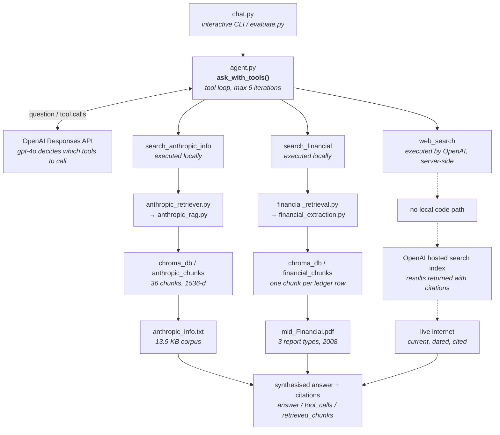

# Multi-Source RAG Agent — Project Summary

**Alpha Data AI Engineering Internship — Engineering Build**

| | |
|---|---|
| **Branch** | `Multi-Source-RAG-Agent-With-Web-Search` (off `Financial_PDF_Tool`) |
| **Folder** | `Multi-Source-RAG-Agent-With-Web-Search/` |
| **Conda env** | `multi-source-rag` (Python 3.11) |
| **Agent model** | `gpt-4o` |
| **Embedding model** | `text-embedding-3-small` (1536 dimensions) |
| **API surface** | OpenAI **Responses API** |
| **Evaluation** | 16 questions × 9 metrics, 2 regression gates |
| **Compiled** | 2026-08-20 |

---

## 1. What was built

The predecessor project, `Financial_PDF_Tool`, was a **two-tool agent** over a narrative document and a financial PDF. This build adds a third capability that the earlier architecture structurally could not support — **live internet access** — and with it a new behaviour: **validation**, where the agent checks whether a claim in its own corpus is still true.

### The three source channels

| Tool | Source | Executed by |
|---|---|---|
| `search_anthropic_info` | Anthropic company corpus — history, products, funding, leadership, safety research | Locally (ChromaDB) |
| `search_financial` | 2008 Wikimedia Foundation financial PDF — accounts, amounts, budget-vs-actual, year-over-year | Locally (ChromaDB) |
| `web_search` | Live internet, returned with citations | **OpenAI, server-side** |

Alongside the agent itself, the build delivers an interactive CLI, a 16-question golden set, a nine-metric evaluation harness with regression gates, automatic staleness detection on the document index, and targeted error handling on the single external call the system depends on.

---

## 2. Architecture

Three source channels converge on one orchestrator. Two are local retrieval functions the application executes itself; the third runs entirely inside OpenAI's infrastructure and **never touches this codebase**.



> **Note the dashed lane.** The agent *declares* the `web_search` tool and *observes* that it was called, but never executes it or handles its raw results. Everything on that lane happens inside OpenAI's infrastructure.

### File inventory

| File | Role | Runs when |
|---|---|---|
| `chat.py` | Interactive CLI, the entry point. Prints answer, tools used, chunks retrieved. | Manually, by the user |
| `agent.py` | Orchestrator. Owns the system prompt, tool definitions, tool loop, retry logic. | Once per question |
| `anthropic_retriever.py` | Thin wrapper exposing document retrieval as a chunks-only function. | On `search_anthropic_info` |
| `anthropic_rag.py` | Chunking, embedding, ChromaDB collection lifecycle, staleness detection. | At import — initialises index |
| `financial_retrieval.py` | ChromaDB collection management and retrieval for financial chunks. | On `search_financial` |
| `financial_extraction.py` | Regex-based PDF line-item parser; builds labelled chunk strings. | Index build only |
| `golden_set.py` | 16 test questions with expected answers and expected tool calls. | Imported by evaluator |
| `evaluate.py` | Nine-metric harness, aggregation, regression gates, JSON scorecard. | Manually, on demand |
| `anthropic_info.txt` | The Anthropic corpus — source of truth for the document channel. | Read at import |
| `chroma_db/` | Persistent vector store, two collections. Committed to git by project convention. | Always |

---

## 3. How the data flows

A genuine sequence — each step depends on the one before it. This is the lifecycle of a **single question**, using a validation question as the worked example because it exercises all three channels.

### Step 1 — Startup: the index is prepared before any question is asked

`chat.py` imports `anthropic_retriever`, which imports `anthropic_rag`. That import **has side effects**: it reads `anthropic_info.txt`, chunks it, hashes it, and either loads the existing ChromaDB collection or rebuilds it. The 36-chunk index is live before the prompt appears.

### Step 2 — The question enters the orchestrator

```python
ask_with_tools(question, retrieve_anthropic_chunks, retrieve_financial_chunks, previous_response_id)
```

Both retrieval functions are **passed in as arguments** — the agent is decoupled from the data sources and depends only on their call signature.

### Step 3 — First API call: the model decides

The question, the system prompt (as `instructions`), and all three tool definitions go to `client.responses.create()`. The model reads the phrasing, matches it against the routing rules, and returns **its intent — not an answer**.

### Step 4 — The response is decomposed into two kinds of tool call

The agent scans `response.output` for:

- `function_call` items → the two local tools
- `web_search_call` items → **already done**

This distinction is the key architectural point. A `web_search_call` has *already executed* — OpenAI ran it server-side and the results are in the model's context. The agent only records that it happened.

### Step 5 — Local tools are executed against ChromaDB

For each `function_call`, the agent parses the arguments, dispatches to the matching retriever, and gets back the **top 3 chunks**. The retriever embeds the query with `text-embedding-3-small` and runs a nearest-neighbour query against the relevant collection.

### Step 6 — Results are returned as `function_call_output`

Chunks are joined into one string per call and packaged with the originating `call_id`. Empty results become the literal string `"No relevant information found."` rather than an empty payload, so the model can reason about the absence.

### Step 7 — The loop continues via `previous_response_id`

Only the **new tool outputs** are sent back — not the conversation history. `previous_response_id` chains to the prior response and OpenAI holds the state server-side. The loop repeats until the model returns no further function calls, capped at 6 iterations.

### Step 8 — Synthesis and return

When the model stops requesting tools, `response.output_text` is the final answer. The agent returns a dict carrying the answer, every tool call made, every chunk retrieved, and the last response ID — which `chat.py` stores to thread the next question onto the same conversation.

> **Why the state handling changed.** The predecessor replayed the full conversation history into every call, which is how Chat Completions works. Carrying that pattern into the Responses API caused the model to lose track of earlier tool results and **silently drop half of multi-part answers**. Switching to `previous_response_id` chaining fixed it — the reasoning is recorded in the docstring of `ask_with_tools`.

---

## 4. How routing actually works

There is **no classifier and no keyword matcher in the codebase**. Tool selection is entirely a function of the system prompt and the phrasing of the question — which makes the prompt the most load-bearing artefact in the project.

### The four routing rules

1. Route company and AI-safety concepts to the document **even when the word "Anthropic" is absent**
2. Route money, accounts, and numbers to the financial tool
3. Route anything asking whether a claim is *still* true through the document and then **always** through web search
4. Call **no tool at all** when nothing can answer the question

Two of these rules were written in response to observed failures. Rule 1 originally read only *"if the question is about Anthropic the company"* — under which **"What is scalable oversight?"** skipped the document entirely and was answered from the model's own knowledge, even though the corpus covers that exact term. The rule was widened to name the concepts explicitly and to instruct the model to treat the document as the source of truth rather than its own training.

### Routing is phrasing-sensitive, by design

| Question asked | Tools called | Answer returned |
|---|---|---|
| "what day is today" | *(none)* | `October 6, 2023` — from training data |
| "What is today's date **according to current sources**?" | `web_search` | `Thursday, August 20, 2026` — correct |

Same underlying knowledge, two different routes. The **trigger vocabulary in the prompt** is what separates them. Broadening the rule to cover all time-sensitive questions is a one-line change if that behaviour is wanted.

### The validation flow

This is the capability the whole build exists to demonstrate. A validation question runs the document channel and the web channel **in sequence**, then reports whether the corpus still holds up. The prompt mandates a one-line verdict before the explanation:

```
VALIDATION RESULT: CONFIRMED - still accurate
VALIDATION RESULT: OUTDATED  - this has changed
VALIDATION RESULT: INCORRECT - the document was wrong
```

Live results:

| Question asked | Verdict | What the web search established |
|---|---|---|
| Is Claude 3.7 Sonnet still the latest model? | **OUTDATED** | Deprecated Feb 2026, superseded by the Claude 5 family |
| Are Google and Amazon still the main investors? | **OUTDATED** | Series H led by Altimeter, Dragoneer, Greenoaks, Sequoia |
| Is Dario Amodei still CEO? | **CONFIRMED** | Corroborated across multiple current dated sources |

> **Observed inconsistency.** In one later run the agent performed the validation correctly — both tools fired, the answer was accurate and cited — but **omitted the mandated `VALIDATION RESULT:` prefix** and simply answered in prose. Functional behaviour held; only the output format drifted. This is ordinary instruction-following variance, and would need either a stricter prompt or a structured-output schema to guarantee.

---

## 5. Work completed this session

Grouped by theme rather than chronology. Each item states what changed and why.

### Corpus expansion and re-indexing
- **What:** `anthropic_info.txt` grew from roughly 8.6 KB to **13.9 KB** with four new sections — competitive landscape, tool use and the Model Context Protocol, alignment research beyond Constitutional AI, and economic and workforce impact. Re-chunking took the index from **26 to 36 chunks**.
- **Why:** the original corpus was too thin to distinguish good retrieval from lucky retrieval, and had little content that would plausibly go stale — which the validation feature needs.

### Migration to the Responses API
- **What:** replaced `client.chat.completions.create()` with `client.responses.create()`; the system prompt moved to the `instructions` parameter; tool schemas flattened; conversation state moved to `previous_response_id`.
- **Why:** the hosted `web_search` tool **exists only on the Responses API**. This was not a preference — the third channel is impossible without it.

### Hash-based staleness detection
- **What:** `initialize_chroma_collection()` now computes a **SHA-256** of the document text and stores it in the collection metadata. On every startup it compares stored hash to current hash and rebuilds automatically on mismatch.
- **Why:** the original code only checked whether the collection *existed*. After expanding the corpus the agent silently kept serving the old 26 chunks. **Verified by test:** the first run detected staleness and rebuilt, the second reported the index up to date and skipped re-embedding.

### Targeted error handling
- **What:** `_call_responses_with_retry()` wraps the single external call the agent depends on. `AuthenticationError` fails immediately with a message pointing at the `.env` file; `RateLimitError`, `APIConnectionError` and `APITimeoutError` retry three times with 1s / 2s / 4s backoff.
- **Why:** scoped deliberately narrow, per instruction — error handling only where essential. Retrying a bad API key cannot succeed, so it is excluded from the retry path rather than burning attempts.

### Runaway-loop guardrail
- **What:** `MAX_TOOL_ITERATIONS = 6`, with a `for...else` fallback message if the loop exhausts without the model settling on an answer.
- **Why:** observed directly during model testing — a weaker model looped on tool calls without ever converging.

### Model selection, tested rather than assumed
- **What:** `gpt-4o-mini` was trialled across **three rounds** against the previously problematic questions. It failed the validation flow **every time** — never reaching `web_search`, hitting the iteration cap instead — and dropped half of multi-part answers. Reverted to `gpt-4o`.
- **Why:** the instruction was to downgrade only if functionality was unaffected. It was affected, measurably, so the stronger model stayed.

### Evaluation harness
- **What:** a 16-question golden set across six categories, and a nine-metric evaluator with two regression gates, writing a full JSON scorecard to `eval_results.json`.
- **Why:** mirrors the methodology already established in `Financial_PDF_Tool`, extended with an `anthropic-validation` category and a gate that specifically asserts `web_search` fires when expected.

### Interactive CLI
- **What:** `chat.py` — a `while True` loop behind an `if __name__ == "__main__"` gate, printing the answer plus a TOOLS USED and CHUNKS RETRIEVED breakdown, threading turns via `previous_response_id`, with `help` and `quit` commands.
- **Why:** makes routing behaviour visible per question, which is what turns the agent from a black box into something demonstrable.

### Log decluttering
- **What:** stripped per-paragraph, per-chunk and per-API-call debug prints from `anthropic_rag.py`; added one matching status line to `financial_retrieval.py`. Each retrieval now emits a single line:
  ```
  [search_anthropic_info] "question" -> 3 chunks
  ```
  A nine-question session dropped to roughly **140 lines** of output.
- **Why:** requested directly. The verbose logging was inherited from the earlier task and made the CLI unreadable.

### Dependency cleanup
- **What:** `openai` pinned to `>=3.3.0`; `ragas` and `langchain-google-vertexai` removed.
- **Why:** the older pin predates Responses API support, and the two removed packages were inherited but never imported.

### Repository housekeeping
- **What:** branch `Multi-Source-RAG-Agent-With-Web-Search` created off `Financial_PDF_Tool`; folder renamed from the `Practical_Task_8_` prefix to match the branch; `CLAUDE.md` written at the repo root and gitignored alongside the other local reference files.
- **Why:** the numbered prefix is reserved for graded curriculum tasks. This is exploratory engineering work, so it takes a plain descriptive name matching its branch.

---

## 6. Bugs found and fixed

Four defects surfaced **during testing rather than review**. The Unicode crash is the notable one — it was only reachable through the new web-search path.

### Unicode crash on live search output
- **Symptom:** a validation question returned a `'charmap' codec can't encode character` error instead of an answer.
- **Cause:** web search results carry typographic Unicode — narrow no-break spaces, smart quotes, en dashes — that Windows consoles on a legacy codepage cannot print. Unlike our own strings, **this content is external and cannot be sanitised in advance**.
- **Fix:** `sys.stdout.reconfigure(encoding="utf-8", errors="replace")` at the top of `chat.py`, `agent.py` and `evaluate.py`. The `errors="replace"` fallback means no character can crash the CLI again.

### Stale embeddings after corpus edit
- **Symptom:** new corpus sections were unreachable; retrieval kept returning the old 26 chunks.
- **Cause:** collection initialisation checked only for existence, never for content drift.
- **Fix:** SHA-256 content hash stored in collection metadata, compared on every startup, automatic rebuild on mismatch.

### Retrieval skipped for concept questions
- **Symptom:** "What is scalable oversight?" answered from model knowledge with no tool call, despite the corpus covering it.
- **Cause:** the routing rule keyed on the literal word "Anthropic".
- **Fix:** rule widened to enumerate the safety and research concepts, plus an explicit instruction to prefer the document over training knowledge.

### CLI crash on piped input
- **Symptom:** unclean exit when stdin reached end-of-file.
- **Cause:** the handler caught `KeyboardInterrupt` only; `input()` raises `EOFError` on a closed pipe.
- **Fix:** catch both. This is what makes the scripted multi-question test runs possible.

---

## 7. Evaluation

16 questions across 9 metrics, LLM-as-judge for the qualitative scores, written to `eval_results.json`.

### Aggregate metrics

| Metric | Mean | Min | Max | Reading |
|---|---|---|---|---|
| Tool accuracy | **1.000** | 1.000 | 1.000 | Correct tool set on all 16 questions |
| Exact-match accuracy | **1.000** | 1.000 | 1.000 | Every expected dollar figure appeared |
| Answer relevancy | 0.953 | 0.500 | 1.000 | One partial: the cross-source conceptual comparison |
| Row / column integrity | 0.875 | 0.000 | 1.000 | Account names paired with their own values |
| Faithfulness | 0.797 | 0.000 | 1.000 | Depressed by an artefact — see caveats |
| Context recall | 0.625 | 0.000 | 1.000 | Same artefact |
| Context precision | 0.375 | 0.000 | 0.667 | Genuinely the weakest number |

### Regression gates

| Gate | Threshold | Actual | Status |
|---|---|---|---|
| Faithfulness on Anthropic-document questions | ≥ 0.95 | **0.964** | ✅ PASS |
| `web_search` reached when expected | ≥ 0.50 | **1.000** | ✅ PASS |

### By question category

| Category | n | Tool acc. | Faithfulness | Relevancy |
|---|---|---|---|---|
| anthropic-single | 5 | 1.000 | 0.950 | 0.950 |
| financial-single | 4 | 1.000 | 1.000 | 1.000 |
| financial-multi | 1 | 1.000 | 1.000 | 1.000 |
| anthropic-validation | 2 | 1.000 | 1.000 | 1.000 |
| mixed-conceptual | 1 | 1.000 | 1.000 | 0.500 |
| mixed-should-refuse | 1 | 1.000 | 0.000 | 1.000 |
| trick-unanswerable | 2 | 1.000 | 0.000 | 1.000 |

### ⚠️ Three caveats that must be stated alongside these numbers

**1. The faithfulness mean understates performance.**
The two `trick-unanswerable` questions **correctly** call no tool, so they retrieve no chunks — and `score_faithfulness()` returns `0.0` whenever the chunk list is empty. Correct refusals are being scored as total grounding failures. Excluding the two zero-chunk questions, faithfulness is **0.911** across the remaining 14. The `mixed-should-refuse` question scores 0.0 for a related reason: the judge penalised an answer that correctly states the document does *not* contain something.

**2. Context precision at 0.375 is the one number reflecting a real weakness.**
Excluding zero-chunk questions it rises to 0.429, still low. The cause is the **chunking strategy**: 150-character backward overlap means retrieved chunks routinely carry a trailing fragment of the preceding section, and the per-chunk relevance judge marks those partially-relevant chunks as irrelevant. Retrieval is finding the right content; the surrounding padding is what scores badly. **This is the clearest candidate for future work.**

**3. The cost metric is not trustworthy as an absolute figure.**
`estimate_cost()` applies `$0.15 / $0.60` per million tokens — **gpt-4o-mini pricing** — while the agent actually runs **gpt-4o**. Token counts are also word-count heuristics, not values read back from the API's usage field. The reported total of `$0.0070` for a full 16-question run therefore **understates real spend substantially**. It is usable for tracking relative change between runs, not for budgeting.

---

## 8. What changed from the predecessor

Direct comparison against `Financial_PDF_Tool`, which supplied the starting point for this build.

### Methodology

| Aspect | Financial_PDF_Tool | This build |
|---|---|---|
| API surface | Chat Completions | **Responses API** |
| Multi-turn state | Full history replayed each call | `previous_response_id`, state held server-side |
| Tools | 2, both local | **3, one hosted remotely** |
| Model | gpt-4o-mini | gpt-4o — downgrade tested and rejected |
| Loop guardrail | none | 6-iteration cap with fallback message |
| Error handling | none | Typed retry with backoff, fail-fast on auth |
| Index freshness | existence check only | content-hash comparison, auto-rebuild |
| Console logging | verbose, per item | one line per operation |
| Unicode safety | none — latent risk remains | UTF-8 stdout with replace fallback |
| Eval categories | story / financial / mixed / trick | adds `anthropic-validation` and a web-search gate |

### Naming

| Before | After |
|---|---|
| `story.txt` | `anthropic_info.txt` |
| `story_rag.py` | `anthropic_rag.py` |
| `story_retriever.py` | `anthropic_retriever.py` |
| `chunk_story()` | `chunk_document()` |
| `ask_about_story()` | `ask_about_anthropic()` |
| `retrieve_story_chunks()` | `retrieve_anthropic_chunks()` |
| collection `story_chunks` | collection `anthropic_chunks` |
| tool `search_story` | tool `search_anthropic_info` |
| gate `story_faithfulness` | `anthropic_faithfulness` + `validation_tool_accuracy` |
| param `conversation_history` | `previous_response_id` — *semantic, not cosmetic* |

> **Not retrofitted.** The fixes above were applied to the copies in this task folder only. `Financial_PDF_Tool` still carries the verbose logging and the same latent Unicode crash risk. That was a deliberate scope decision rather than an oversight, but it does mean the two folders have now diverged.

---

## 9. Current state

### ✅ Verified working
- All three tools routing correctly across a nine-question live session and the full 16-question evaluation
- Validation flow reaching `web_search` on every validation question
- Multi-part questions calling two tools and answering both halves
- Staleness detection rebuilding on change and skipping when current
- Zero crashes across the full re-test after the UTF-8 fix

### ⬜ Open items
- **Everything is uncommitted** on the branch — the last commit predates this session's work
- **`notes.md` not yet written** — deferred by explicit decision to the end of the task
- Context precision at 0.375 — chunking overlap is the likely lever
- Cost metric uses the wrong model's pricing and heuristic token counts
- Validation verdict format not guaranteed — observed drifting once
- `Financial_PDF_Tool` not retrofitted with the fixes

> **Scope confirmation.** No file inside any other task folder was created, modified or deleted during this session. Pre-existing uncommitted changes in `AI_Agent_Evaluation`, `Practical_Task_5` and `Financial_PDF_Tool` were already present at the start and are unrelated to this work.

---

## Appendix — How to run it

```bash
conda activate multi-source-rag
```

```bash
cd "C:\Users\jouni\alpha-intern-project\Multi-Source-RAG-Agent-With-Web-Search"
```

Interactive CLI:

```bash
python chat.py
```

Full evaluation (writes a fresh `eval_results.json`):

```bash
python evaluate.py
```

### Sample questions by channel

| Channel | Example |
|---|---|
| Document | `Who founded Anthropic?` · `What is Constitutional AI?` · `What is scalable oversight?` |
| Financial | `What was the Unrestricted Public Support amount?` · `What is the Balance Sheet total for checking/savings?` |
| Multi-tool | `What is the total checking/savings balance, and who is Anthropic's CEO?` |
| Validation | `Is Claude 3.7 Sonnet still Anthropic's latest model?` · `Are Google and Amazon still Anthropic's main investors?` |
| No tool | `What is the answer to life, the universe, and everything?` |

---

*Alpha Data AI Engineering Internship · AI Centre of Excellence (Addax Tower) · compiled 2026-08-20*
